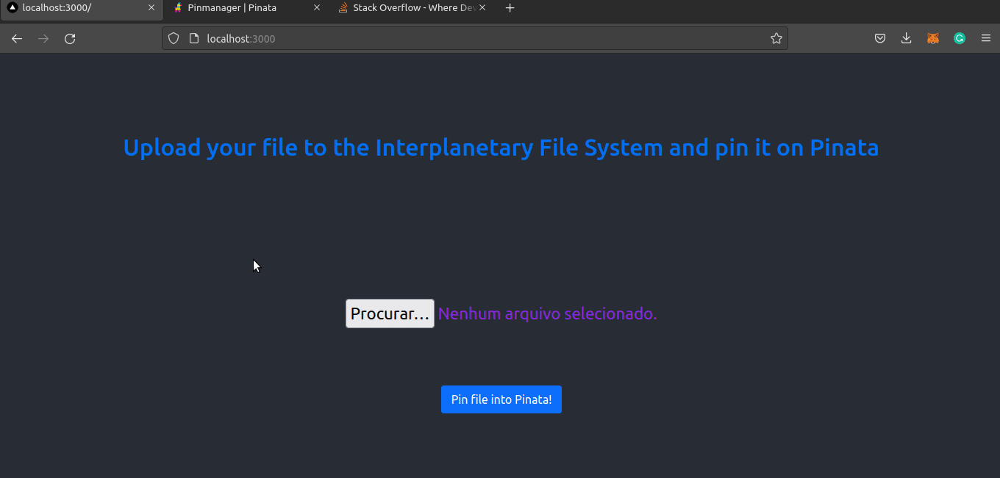

Projeto API Pinata 

referencias para construção do projeto:
i) https://github.com/valterlobo/ipfs-example/blob/master/src/App.js
ii) https://github.com/dabit3/polygon-ethereum-nextjs-marketplace/blob/main/pages/create-nft.js
iii) https://www.youtube.com/watch?v=XeiOnkEI7XI - Academind
iv) https://docs.pinata.cloud/api-pinning/pin-file#javascript-example-with-axios

Funcionalidades:

 - Usuário faz o upload do arquivo, este mesmo arquivo é enviado para a rede Interplanetary 
 File System e marcado através da ferramenta Pinata (via API da Pinata);

 